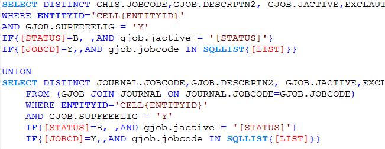
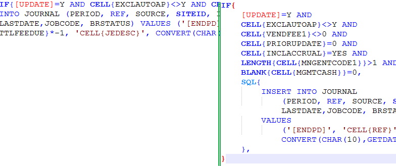

An old hobby project (from 2010) that aimed to make it easier to work with the expression language in MRI Software.

It's a plugin for Notepad++ (that still works as of version 7.4.2) that highlights and aids in formatting expressions.

### Features ###
**Syntax highlighting**

**Code indenting**

### Issues ###
* There are no unit tests
* The setup project is _really_ old and the tech is obsolete so it won't open in modern IDEs. The last working installation files are available here: [Setup File](./Install%20Files/setup.exe)